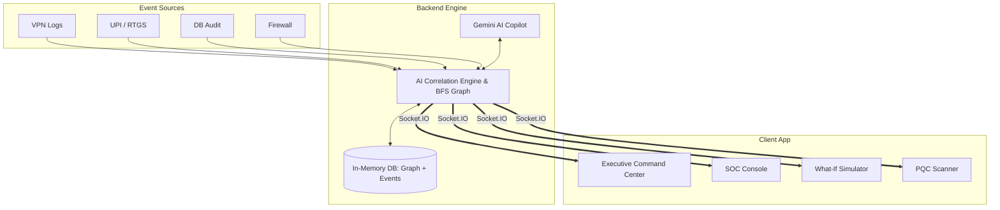

<div align="center">
  
  
  <h1 align="center">KavachX</h1>
  <p align="center">
    <strong>AI-Driven Cyber Threat Correlation & Decision Intelligence Platform</strong>
    <br/>
    <em>Created by Greybox Labs</em>
  </p>

  <p align="center">
    
    
    
    
    
  </p>
</div>

---

## ⚡ What is KavachX?

KavachX is a real-time **Security Operations Centre (SOC)** platform purpose-built for the banking and financial services sector (BFSI). It solves the most critical blind spot that modern financial institutions face today: **the siloed nature of cybersecurity and transactional data**. 

Currently, network logs live in traditional SIEM tools, while UPI/RTGS transaction data lives in core banking systems. There is no unified intelligence layer correlating them. **KavachX bridges this gap.**

### 🎯 Core Capabilities

1. **🧠 AI Correlation Engine**: Correlates cybersecurity telemetry (VPN, firewall, DB queries) with transactional events (UPI, RTGS, NEFT) in real-time.
2. **🔮 Threat Forecast Engine**: Predicts the next logical attack step using a deterministic risk engine with explainable AI factors.
3. **💰 Financial Exposure Quantification**: Quantifies blast radius and potential loss in INR *before* a breach is complete.
4. **🔐 Quantum-Ready Posture**: Flags Post-Quantum Cryptography (PQC) vulnerabilities across banking infrastructure—addressing the *Harvest-Now-Decrypt-Later* (HNDL) threat.
5. **🤖 Gemini AI Copilot**: Responds via AI-powered decision intelligence, providing SOC analysts with full incident context, RBI obligations, and instant containment playbooks.

---

## 🏛 Architecture



---

## 🌟 Key Features

| Feature | Description |
| :--- | :--- |
| **Cyber Health Index** | Real-time aggregate risk score (0–100) with live, dynamic trend charts. |
| **Cross-Signal AI** | Intelligent detection across cyber + transactional events to catch complex multi-stage attacks. |
| **Incident Investigator** | Full attack chain timeline accompanied by an interactive entity relationship graph. |
| **Gemini AI Copilot** | LLM infused with full incident context—calculates blast radius, compliance obligations, and writes containment scripts. |
| **What-If Simulator** | BFS graph traversal to mathematically calculate the true blast radius of any theoretical asset compromise. |
| **PQC Scanner** | Automated audit against NIST FIPS 203/204/205 standards with HNDL financial exposure mapping. |
| **Dynamic Trust Scoring** | Real-time behavioral scoring for employees, devices, and financial accounts. |
| **SOC Console** | Live panoramic threat map with streaming event log terminals in a stunning Minimalist Flat Dark UI. |

---

## 🚀 Quick Start

### Prerequisites
- Node.js 18+
- A Gemini API key from [Google AI Studio](https://aistudio.google.com)
- Ai models and ML prediction modules
- basic cyber security exposure 

### Installation & Setup

```bash
# 1. Clone the repository and install dependencies
npm install

# 2. Configure your environment
cp .env.example .env.local

# 3. Add your Gemini API key to .env.local
# GEMINI_API_KEY=your_google_gemini_api_key

# 4. Spin up the development server
npm run dev
```

The application will be running at `http://localhost:5069`.

---

## 🔐 Demo Login Credentials

KavachX supports Role-Based Access Control (RBAC). Use the following credentials to explore different views:

| Role | Username / ID | Password | Access Level |
| :--- | :--- | :--- | :--- |
| **CISO Admin** | `ADMIN_CISO_01` | `kavachx2024` | Full platform control, Executive Command Center |
| **SOC Analyst** | `SOC_ANALYST_01` | `analyst2024` | Incident Investigation, Live SOC Console |
| **Demo Access** | `demo` | `demo` | Read-only general exploration |

---

## 🎬 Live Demo Walkthrough

1. **Login** ➔ Arrive at the **Command Center** and monitor the live Cyber Health Index.
2. **Start Demo Simulation** ➔ Watch a 12-step advanced persistent threat (APT) unfold in real-time.
3. **Investigate Critical Incident** ➔ Explore the attack timeline, entity relationship graph, and risk explanation.
4. **Consult AI Copilot** ➔ Ask the Gemini-powered copilot for containment scripts and RBI compliance steps.
5. **Run What-If Simulator** ➔ Type `DB_CORE_1` to see the BFS graph calculate the potential blast radius.
6. **Audit Cryptography** ➔ Visit the PQC Scanner to evaluate the quantum-readiness of 12 critical banking assets.
7. **Monitor the SOC** ➔ Switch to the SOC Console to view the gorgeous panoramic threat map and streaming event logs.

---

## 📜 Regulatory & Compliance Alignment

KavachX is built from the ground up to align with modern regulatory frameworks:
- **RBI Cybersecurity Framework** — Automated incident notification timelines & SOC operational requirements.
- **IT Act Section 43A** — Reasonable security practices for sensitive financial data.
- **NPCI Guidelines** — Stringent UPI and RTGS transaction monitoring.
- **NIST FIPS 203/204/205** — Post-Quantum Cryptography migration standards readiness.
- **PCI DSS v4.0** — Card data encryption compliance tracking.
- **ISO 27001** — Alignment with global information security management standards.

---
<div align="center">
  <p>Engineered with precision by <strong>Greybox Labs</strong>.</p>
</div>
