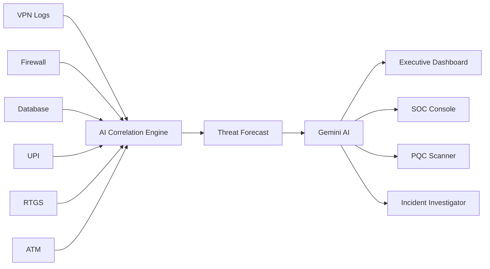
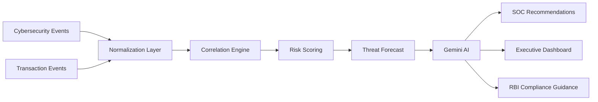
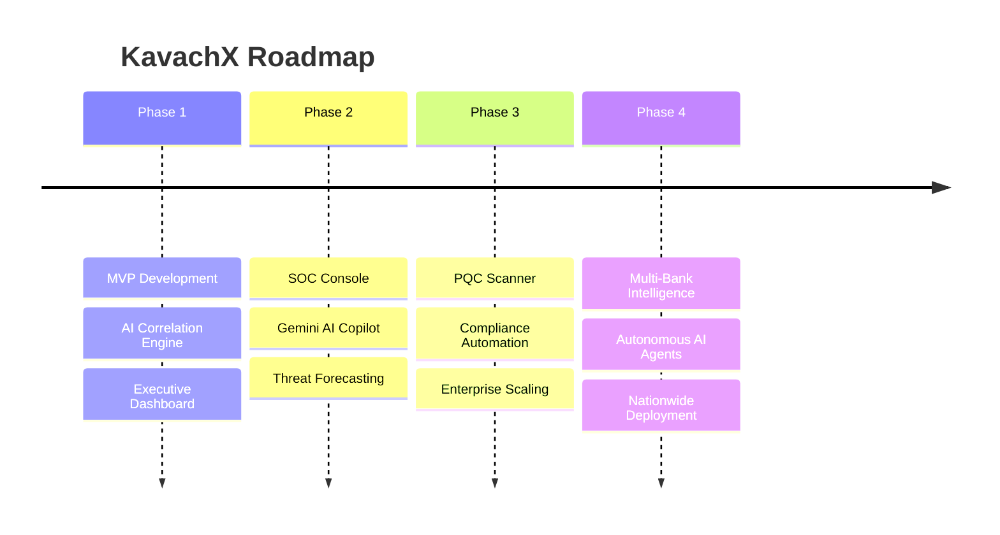

<div align="center">


### AI-Native Cyber Resilience Command Center for Modern Banking

**Predict • Prioritize • Protect**

Built by **Greybox Labs**

---

[](https://kavach-x-omega.vercel.app/)
[]()
[]()
[]()
[]()
[]()

---

### 🌐 Live Deployment

## https://kavach-x-omega.vercel.app/

</div>

---

# 🏦 Banks Don't Need More Alerts. They Need More Context.

Every second, banks process millions of cybersecurity events and financial transactions.

Unfortunately, these systems rarely communicate with one another.

A VPN login appears in one dashboard.

A suspicious RTGS transfer appears in another.

A privileged database query appears somewhere else.

Security analysts are left connecting the dots manually.

### **KavachX changes that.**

Instead of treating every event independently, KavachX intelligently correlates cybersecurity telemetry with transactional behaviour, transforming isolated alerts into a single, explainable attack narrative.

The result is faster investigations, fewer false positives, improved fraud detection, and proactive cyber resilience.

---

# 🎯 Problem Statement

> **FinSpark'26**
>
> **Track 2**
>
> **AI-Driven Correlation of Cybersecurity Telemetry & Transactional Behaviour**

---

# 📊 Banking Security Today


---

# ⚡ Enter KavachX

```text
 Cybersecurity Events
          │
          ▼
 Banking Transactions
          │
          ▼
──────────────────────────
 AI Correlation Engine
──────────────────────────
          │
          ▼
 Unified Attack Narrative
          │
 ┌────────┼────────┐
 ▼        ▼        ▼
AI      Forecast   PQC
          │
          ▼
 SOC Decision Intelligence
```

---

# ✨ Why KavachX?

Traditional security platforms answer:

> **"What happened?"**

KavachX answers:

✅ Why did it happen?

✅ How are these events connected?

✅ Which banking assets are affected?

✅ What will happen next?

✅ What should the SOC team do immediately?

---

# 🆚 Traditional SIEM vs KavachX

| Traditional SIEM | KavachX |
|------------------|----------|
| Reactive monitoring | Predictive intelligence |
| Isolated alerts | Correlated attack stories |
| Manual investigations | AI-assisted investigations |
| Generic risk scoring | Banking-aware risk scoring |
| No financial context | Business impact analysis |
| No quantum visibility | PQC readiness monitoring |

---

# 🚀 Core Innovations

## 🧠 AI Correlation Engine

Instead of analyzing logs individually, KavachX correlates

- VPN Sessions
- Firewall Events
- IAM Authentication
- Endpoint Logs
- Database Queries

with

- UPI
- RTGS
- NEFT
- ATM
- Core Banking
- Customer Behaviour

to build a complete attack graph.

---

## 🔮 Threat Forecast Engine

Predicts the attacker's next probable action before damage occurs.

Instead of reacting to incidents...

KavachX predicts them.

---

## 🤖 Gemini AI Copilot

The AI assistant provides

- Incident Summaries
- Blast Radius Analysis
- RBI Compliance Guidance
- Containment Recommendations
- Executive Reports

using contextual banking intelligence.

---

## 💰 Financial Exposure Engine

Every attack is translated into

- Financial Loss
- Operational Risk
- Business Impact
- Critical Assets

allowing executives to prioritize responses.

---

## 🔐 Quantum Readiness Scanner

Banks rely heavily on cryptography.

KavachX continuously evaluates

- RSA
- ECC
- Legacy Encryption

against

- NIST FIPS 203
- FIPS 204
- FIPS 205

helping organizations prepare for **Harvest Now, Decrypt Later** attacks.

---

# 🏗️ How KavachX Thinks



---

# 📈 Platform Metrics

<div align="center">

| ⚡ Event Throughput | ⚙️ Latency | 🤖 AI Engine |
|:------------------:|:----------:|:------------:|
| **4.2M+**<br>Events / Hour | **14 ms** | **Gemini AI** |

| 🔐 PQC Monitoring | 🚨 Threat Correlation | 🏦 Banking Context |
|:----------------:|:--------------------:|:-----------------:|
| **Enabled** | **Real-Time** | **Native** |

</div> 
---

# ⚙️ Inside KavachX

KavachX is built as a modular, AI-native cybersecurity platform where every incoming event is analyzed, correlated, enriched, and transformed into actionable intelligence within milliseconds.

Instead of flooding analysts with thousands of disconnected alerts, KavachX continuously builds a living attack graph that evolves as new telemetry arrives.

---

# 🏗️ Platform Architecture

```text
                    External Sources
 ┌─────────────────────────────────────────────────────┐
 │                                                     │
 │  VPN   Firewall   IAM   Endpoint   Database   APIs  │
 │                                                     │
 └─────────────────────────┬───────────────────────────┘
                           │
                           ▼
                 Cyber Telemetry Collector
                           │
                           │
          Banking Transaction Collector
       (UPI • RTGS • NEFT • ATM • CBS Logs)
                           │
                           ▼
              AI Correlation & Risk Engine
                           │
      ┌────────────────────┼────────────────────┐
      ▼                    ▼                    ▼
 Threat Forecast      Gemini AI          PQC Scanner
      │                    │                    │
      └──────────────┬─────┴──────────────┬─────┘
                     ▼
          Executive Decision Dashboard
```

---

# 🧠 AI Decision Pipeline

Every event entering KavachX follows an intelligent processing pipeline.



The result is not just another security alert—but a complete explanation of **what happened, why it happened, and what should happen next.**

---

# 🔄 Attack Correlation Flow

Below is the attack simulation demonstrated during the live demo.

```text
📧 Phishing Email
        │
        ▼
🔑 Credential Theft
        │
        ▼
🌍 Suspicious VPN Login
        │
        ▼
🗄 Database Access
        │
        ▼
💸 High Value RTGS Request
        │
        ▼
🤖 AI Correlation
        │
        ▼
🚨 Critical Incident Created
        │
        ▼
🛡 Containment Recommendations
```

Instead of creating **five independent alerts**, KavachX correlates every signal into **one unified attack narrative**.

---

# 🧩 Core Platform Modules

## 🛡 Executive Command Center

The Command Center provides CISOs and executives with a real-time overview of organizational cyber health.

Features include:

- Cyber Health Index
- Enterprise Risk Score
- Financial Exposure
- Live Incident Feed
- Active Threats
- Compliance Status
- Business Impact Overview

---

## 💻 SOC Console

Designed for security analysts.

Provides:

- Live Event Streaming
- Threat Timeline
- AI Correlation Feed
- Incident Queue
- Real-Time Investigation
- Interactive Attack Graph

---

## 🤖 Gemini AI Copilot

Gemini acts as the organization's cybersecurity assistant.

Example prompts:

> Explain this attack.

> Why is the risk score critical?

> Generate containment steps.

> Which RBI guidelines apply?

> Summarize this incident.

Gemini understands the full incident context before generating recommendations.

---

## 🔮 Threat Forecast Engine

Unlike conventional SIEMs, KavachX predicts attacker movement.

Example

```text
Current Event

↓

Database Enumeration

↓

Likely Next Step

↓

Credential Dumping

↓

Estimated Time

↓

3 Minutes
```

This allows SOC teams to respond **before** damage occurs.

---

## 🔐 Post-Quantum Cryptography Scanner

The PQC Scanner continuously evaluates cryptographic assets against emerging quantum threats.

Supported Standards

- NIST FIPS 203
- NIST FIPS 204
- NIST FIPS 205

Evaluates

- RSA
- ECC
- TLS Certificates
- Legacy Encryption
- Critical Banking Assets

Outputs

- Risk Level
- Migration Priority
- Estimated Financial Exposure

---

# 🎬 Experience KavachX

The complete platform can be explored in under five minutes.

```text
Login
   │
   ▼
Executive Dashboard
   │
   ▼
Start Attack Simulation
   │
   ▼
Observe AI Correlation
   │
   ▼
Investigate Incident
   │
   ▼
Consult Gemini AI
   │
   ▼
Run Threat Forecast
   │
   ▼
Evaluate PQC Readiness
```

---

# 📷 Platform Gallery

> Replace each placeholder with an actual screenshot.

## Executive Command Center


---

## Live SOC Console


---

## Incident Investigation


---

## Gemini AI Copilot


---

## Threat Forecast


---

## Quantum Readiness Scanner


---

# 🛠 Technology Stack

| Layer | Technologies |
|--------|--------------|
| **Frontend** | React 19, TypeScript, Tailwind CSS |
| **Backend** | Node.js, Express.js |
| **Realtime Engine** | Socket.IO |
| **Artificial Intelligence** | Google Gemini AI |
| **Visualization** | React Flow, Interactive Graphs |
| **Charts** | Chart.js |
| **Authentication** | Session-based RBAC |
| **Deployment** | Vercel |

---

# 📂 Project Structure

```text
KavachX
│
├── src
│   ├── components
│   ├── pages
│   ├── hooks
│   ├── services
│   ├── assets
│   └── types
│
├── server
│   ├── routes
│   ├── middleware
│   ├── controllers
│   └── services
│
├── public
│
├── docs
│   ├── screenshots
│   ├── diagrams
│   └── assets
│
└── README.md
```

---

# 🚀 Getting Started

## Prerequisites

- Node.js 18+
- npm
- AI Modules
- ML Engines and models
- Telemetry Connector
- Google Gemini API Key

---

## Installation

```bash
# Clone Repository

git clone https://github.com/aice18/kavachX.git

cd kavachX

# Install dependencies

npm install

# Configure Environment

cp .env.example .env.local

# Add your Gemini API Key

GEMINI_API_KEY=YOUR_API_KEY

# Start Development Server

npm run dev
```

Open

```
http://localhost:5069
```

---

# 🔑 Demo Credentials

| Role | Username | Password |
|------|----------|----------|
| 👨‍💼 CISO | ADMIN_CISO_01 | kavachx2024 |
| 🛡 SOC Analyst | SOC_ANALYST_01 | analyst2024 |
| 👤 Demo | demo | demo |

---

# 🛡️ Security by Design

KavachX follows a **Zero Trust** architecture and incorporates enterprise-grade security principles across every layer of the platform.

Rather than relying on perimeter defenses, every request, user, device, and event is continuously validated before access is granted or actions are recommended.

---

## 🔐 Security Layers

```text
                    🌐 Internet
                         │
                         ▼
                 HTTPS / TLS Encryption
                         │
                         ▼
              Authentication & RBAC
                         │
                         ▼
            Session Validation & Access Control
                         │
                         ▼
             AI Correlation & Risk Analysis
                         │
                         ▼
             Secure Banking Intelligence Layer
```

---

## Security Features

| Feature | Description |
|----------|-------------|
| 🔒 Zero Trust Architecture | Every request is verified before processing |
| 👥 Role-Based Access Control | Separate dashboards for CISO and SOC teams |
| 🛡 Secure Authentication | Session-protected routes and APIs |
| 📋 Audit Logging | Complete activity tracking |
| 🤖 Explainable AI | Every AI recommendation includes reasoning |
| 🔐 PQC Readiness | Continuous cryptographic posture assessment |
| 🌐 Secure APIs | Encrypted communication across services |

---

# 🏛 Regulatory Compliance

KavachX is designed around regulatory expectations for the banking sector.

| Framework | Purpose |
|-----------|----------|
| RBI Cyber Security Framework | Incident monitoring & reporting |
| NPCI Guidelines | Secure payment transaction monitoring |
| PCI DSS v4.0 | Protection of payment card information |
| ISO/IEC 27001 | Information Security Management |
| IT Act Section 43A | Reasonable security practices |
| NIST FIPS 203 | ML-KEM (Post-Quantum Encryption) |
| NIST FIPS 204 | ML-DSA (Post-Quantum Signatures) |
| NIST FIPS 205 | Stateless Hash-Based Signatures |

---

# 📈 Business Impact

KavachX isn't just a cybersecurity dashboard—it is a decision intelligence platform designed to improve both security operations and business resilience.

```text
Cyber Events
      │
      ▼
AI Correlation
      │
      ▼
Threat Prediction
      │
      ▼
Faster Decisions
      │
      ▼
Reduced Financial Loss
      │
      ▼
Business Continuity
```

---

## Benefits for Financial Institutions

✅ Faster incident response

✅ Reduced false positives

✅ Improved fraud detection

✅ Executive-level visibility

✅ AI-assisted investigations

✅ Regulatory compliance support

✅ Quantum-ready infrastructure

---

# 📊 Platform Advantages

<div align="center">

| Capability | Traditional SIEM | 🛡️ KavachX |
|:-----------|:----------------:|:----------:|
| 🔗 Event Correlation | Partial | ✅ AI-Driven |
| 🏦 Banking Context | ❌ Generic | ✅ Native BFSI |
| 🔮 Threat Forecasting | ❌ Reactive | ✅ Predictive AI |
| 🤖 Explainable Intelligence | ❌ No | ✅ Gemini AI |
| 💰 Financial Impact Analysis | ❌ Not Available | ✅ Built-in |
| 🔐 PQC Assessment | ❌ No | ✅ Continuous Monitoring |
| 📊 Executive Dashboard | ⚠️ Limited | ✅ Real-Time Insights |

</div>

---

# 📈 Scalability

KavachX is designed with enterprise adoption in mind.

```text
Single Branch
      │
      ▼
Regional Office
      │
      ▼
Multi-State Deployment
      │
      ▼
National Banking Network
      │
      ▼
Multi-Bank Ecosystem
```

Supports

- Multiple banking branches
- Distributed deployments
- Horizontal scaling
- Real-time event streaming
- API-first integrations
- High-volume telemetry ingestion

---

# 🚀 Deployment

### 🌐 Live Demo

https://kavach-x-omega.vercel.app/

---

### 💻 GitHub Repository

https://github.com/aice18/kavachX

---

# 🗺️ Product Roadmap



---

# 🔮 Future Vision

Our long-term vision is to transform KavachX into a fully autonomous cyber resilience platform capable of assisting financial institutions across India.

Future capabilities include:

- 🤖 Multi-Agent SOC
- 🧠 Autonomous Threat Hunting
- 🌍 Cross-Bank Threat Intelligence
- 📄 Automated RBI Reporting
- 📱 Executive Mobile Dashboard
- ☁️ Cloud-Native Microservices
- 🛰️ Threat Intelligence Feeds
- 🔐 Quantum-Safe Migration Assistant

---

# 👥 Team Greybox Labs

<table>
<tr>

<td align="center" width="50%">

## 👨‍💻 Ayush Kumar Choudhary

**Team Lead • AI & Backend Engineering**

Threat Intelligence • System Architecture • AI Integration • Cybersecurity

</td>

<td align="center" width="50%">

## 👩‍💻 Jyotsna G

**Frontend Engineer**

User Experience • Dashboard Design • Visualization • Testing

</td>

</tr>
</table>

---

# 🤝 Contributing

Contributions, suggestions, and improvements are always welcome.

1. Fork the repository
2. Create a feature branch
3. Commit your changes
4. Submit a Pull Request

---

# 📜 License

Developed as part of **FinSpark'26 — AI-Driven Correlation of Cybersecurity Telemetry & Transactional Behaviour**.

This repository is intended for educational, research, and hackathon demonstration purposes.

---

# 🙏 Acknowledgements

Special thanks to:

- **FinSpark'26** for providing a real-world cybersecurity challenge.
- **Bank of Maharashtra**
- **Indian Banks' Association (IBA)**
- **Department of Financial Services**
- **COEP Technological University**
- **Google Gemini AI** for powering intelligent decision support.

---

<div align="center">


# KavachX

### AI-Native Cyber Resilience Command Center

### Predict • Prioritize • Protect

---

🌐 **Live Demo**

https://kavach-x-omega.vercel.app/

⭐ **GitHub Repository**

https://github.com/aice18/kavachX

---

> *"Cybersecurity isn't about collecting more alerts—it's about delivering the right intelligence at the right moment."*

### Built with ❤️ by **Greybox Labs**

**FinSpark'26 • Banking Cybersecurity Innovation**

</div>
