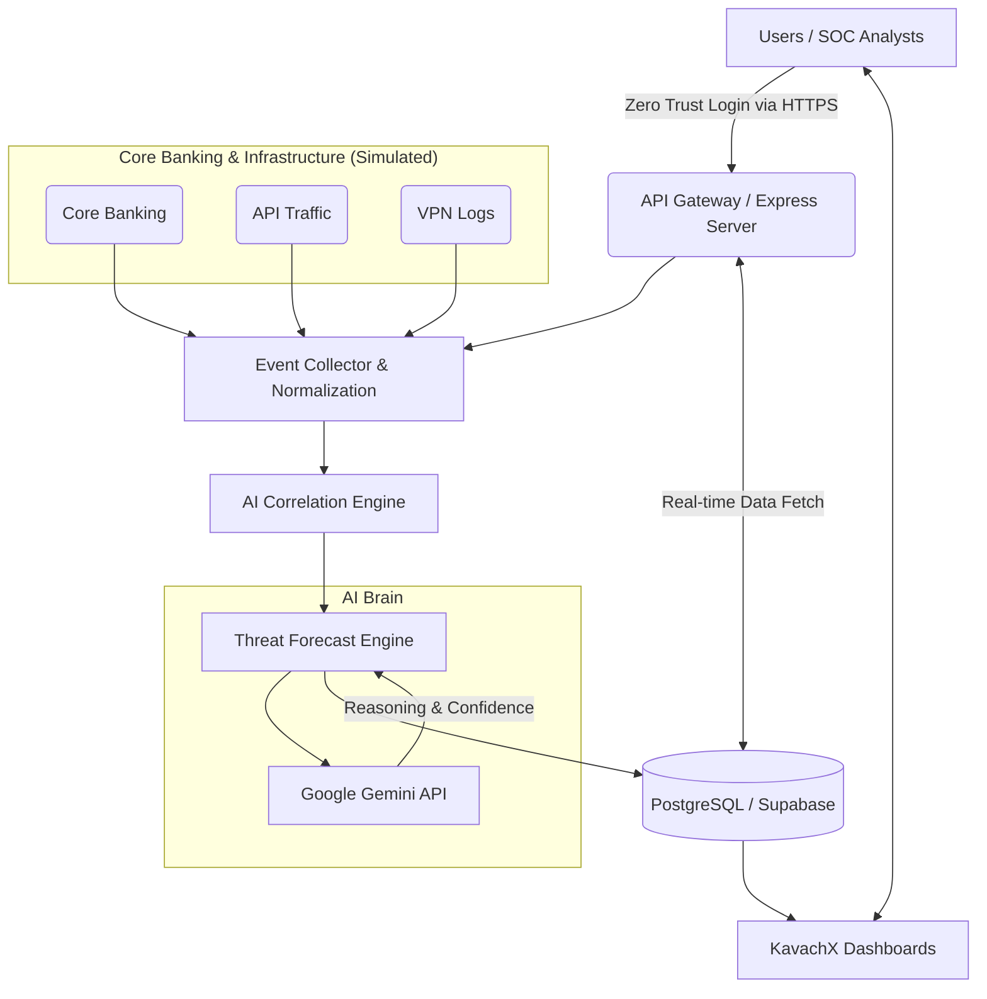

# KavachX Architecture Document

## 1. High-Level Architecture (HLD)

The KavachX platform is designed as an AI-native command center that acts as a secure, real-time intelligence layer over a bank's existing infrastructure.

## 2. Low-Level Design (LLD)

### React Frontend
- **Framework:** Vite + React + TypeScript.
- **State Management:** React Context (`AuthContext.tsx`) for global user state; component-level state for rapid dashboard UI updates.
- **Visuals:** Tailwind CSS for styling, Recharts for rendering the Threat Forecast and Exposure trend charts, Framer Motion for micro-animations.
- **Routing:** React Router DOM (e.g. `/dashboard`, `/analytics`, `/what-if`).

### Express Backend
- **Framework:** Node.js + Express.js.
- **Structure:** Modular architecture separated into Controllers (`metrics.controller`, `ml.controller`), Routes, and DB config.
- **Role:** Handles incoming API requests from the frontend, queries PostgreSQL, and interfaces with external AI models (Gemini).

### Database (PostgreSQL via Supabase)
- **Role:** Stores structured data including Tenants, Users, Incidents, Playbooks, and Audit Logs.
- **Integration:** Accessed via `pg` (node-postgres) driver using pooled connections for scalability.

### Gemini Integration
- **Role:** Acts as the AI intelligence layer for the platform, simulating complex ML workloads.
- **Implementation:** The `ml.controller.ts` constructs domain-specific prompts (Anomaly Detection, Sequence Analysis, Threat Scoring) injecting raw telemetry, and parses the structured JSON responses returned by Gemini.

### Authentication
- **Flow:** Stateless JSON Web Token (JWT) authentication.
- **Mechanics:** 
  1. Client sends email/password to `/api/auth/login`.
  2. Backend validates against PostgreSQL `users` table.
  3. Returns a signed JWT.
  4. Client stores the token in memory/Context and attaches it as a Bearer token in subsequent requests (or via HTTP-only cookies).

### API Flow
1. **Frontend Request:** React component calls `fetch('/api/...')`.
2. **Proxy:** Vite proxy routes request from `localhost:5173` to `localhost:3001`.
3. **Routing:** Express Router matches endpoint and directs to Controller.
4. **Processing:** Controller fetches data from DB or calls Gemini API.
5. **Response:** JSON payload is sent back to React for rendering.
