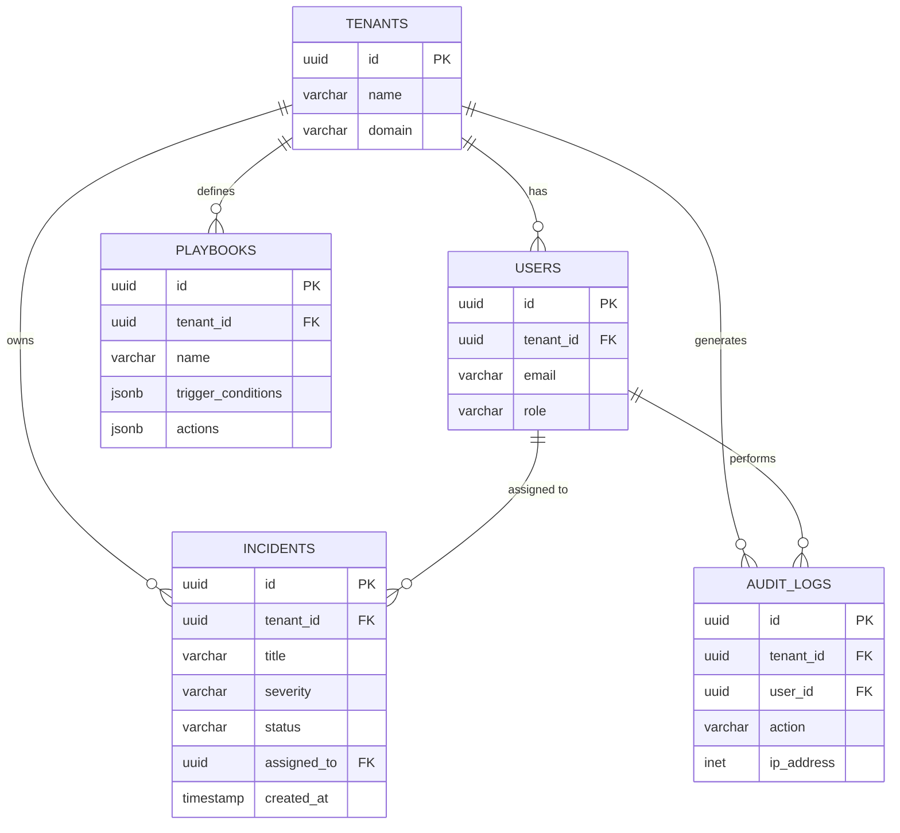

# Database Schema

KavachX utilizes a multi-tenant PostgreSQL database designed for high-throughput security event logging and role-based access control.

## ER Diagram

## Core Tables Explained

1. **`tenants`**
   - **Purpose:** Supports multi-tenancy. Every piece of data in the system belongs to a tenant (e.g., a specific bank branch or corporate entity).
   
2. **`users`**
   - **Purpose:** Manages authentication and RBAC (Role-Based Access Control). Includes fields for `role` (admin, analyst, viewer) and MFA configuration.

3. **`incidents`**
   - **Purpose:** The core table for the SOC Dashboard. Stores correlated security alerts, their `severity` (low, medium, high, critical), and their lifecycle `status` (active, investigating, resolved).

4. **`playbooks`**
   - **Purpose:** Stores JSON-defined automated response workflows (e.g., "If ransomware detected -> Isolate VLAN").

5. **`audit_logs`**
   - **Purpose:** Immutable ledger of all system actions for compliance (e.g., RBI cybersecurity guidelines). Tracks who did what, when, and from what IP address.
