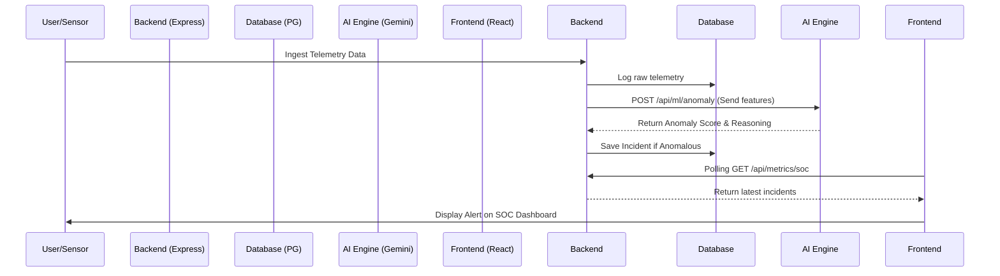
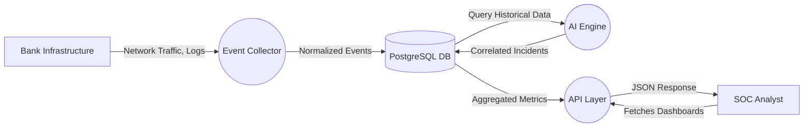
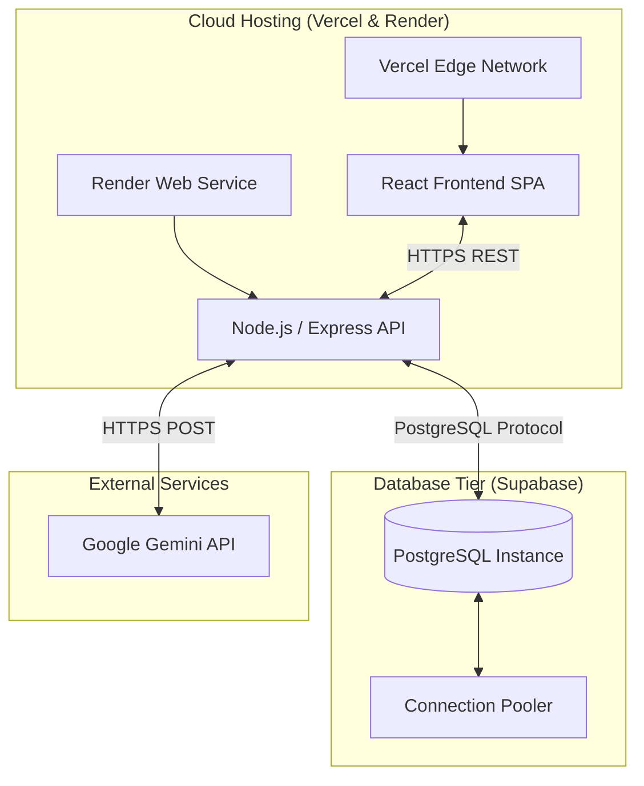

# System Flow Diagrams

## 1. Workflow Diagram (End-to-End Threat Lifecycle)

```mermaid
graph TD
    A[Raw Log Generation (VPN, DB, APIs)] --> B[Event Collection Layer]
    B --> C[Data Normalization]
    C --> D{Is Known Threat?}
    D -->|Yes| E[Trigger Playbook]
    D -->|No| F[AI Correlation & Anomaly Detection]
    F --> G{Anomaly Score > Threshold?}
    G -->|Yes| H[Generate AI Threat Alert]
    G -->|No| I[Store for Baseline]
    H --> J[SOC Analyst Triage]
    J --> K[AI Copilot Analysis]
    K --> E
    E --> L[Containment & Audit]
```

## 2. Sequence Diagram (AI Anomaly Detection Flow)



## 3. Data Flow Diagram (DFD)



## 4. Deployment Diagram


